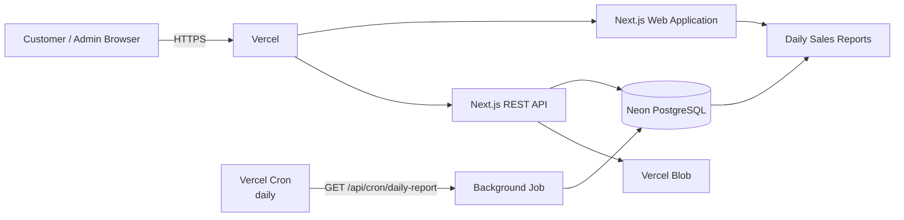

# 🌸 Žiedai – flower shop

Universitetinei užduočiai skirta web aplikacija.

## Užduoties reikalavimų įgyvendinimas

### 1. PaaS

Aplikacija deployinama į Vercel.

### 2. CRUD + list

Puokščių CRUD:

- Create – sukurti naują puokštę
- Read – peržiūrėti puokštę ir visą sąrašą
- Update – pažymėti kaip parduotą / keisti duomenis per API
- Delete – ištrinti puokštę
- List – pagrindiniame puslapyje rodomos visos puokštės

### 3. Web application

Pagrindinis puslapis sukurtas pagal pateiktą „Žiedai“ HTML dizaino kryptį:

- rožinė spalvų paletė
- „Daugiau nei gėlės – daugiau jausmų“
- puokščių kortelės
- naujos puokštės mygtukas
- puokštės detalės puslapis
- pardavimo veiksmas
- pardavimų ataskaitų langas

### 4. Public API

REST API:

```text
GET    /api/bouquets
POST   /api/bouquets
GET    /api/bouquets/:id
PATCH  /api/bouquets/:id
DELETE /api/bouquets/:id
POST   /api/bouquets/:id/sold

POST   /api/files
GET    /api/reports

GET    /api/cron/daily-report
```

## 5. Persistence

### PostgreSQL

Naudojamas Neon PostgreSQL.

`bouquets` lentelėje saugoma:

- pavadinimas
- aprašymas
- kaina
- nuotraukos URL
- statusas
- pardavimo laikas
- sukūrimo / atnaujinimo laikas

`daily_sales_reports` lentelėje saugoma:

- data
- parduotų puokščių kiekis
- pajamos

### File storage

Puokščių nuotraukos saugomos Vercel Blob.

Duomenų bazėje išsaugomas tik Blob URL.

## 6. Background task

Vercel Cron kiekvieną dieną paleidžia:

```text
GET /api/cron/daily-report
```

Jobas apskaičiuoja **ankstesnės dienos**:

```text
kiek parduota puokščių
+
kiek gauta pajamų
```

ir įrašo rezultatą į:

```text
daily_sales_reports
```

Pavyzdys:

```text
2026-10-01    3 puokštės    300.00 €
2026-10-02    5 puokštės    420.00 €
2026-10-03    2 puokštės    150.00 €
```

Ataskaita pasiekiama:

```text
/reports
```

## 7. Architecture

