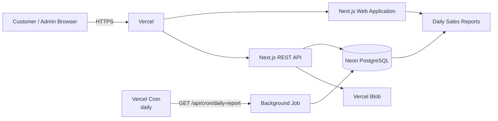

# 🌸 Žiedai – Vercel flower shop

Universitetinei užduočiai skirta full-stack web aplikacija.

## Užduoties reikalavimų įgyvendinimas

### 1. PaaS

Aplikacija deployinama į Vercel.

### 2. CRUD + list

Puokščių CRUD:

- Create – sukurti naują puokštę
- Read – peržiūrėti puokštę ir visą sąrašą
- Update – pažymėti kaip parduotą / keisti duomenis per API
- Delete – ištrinti puokštę
- List – pagrindiniame puslapyje rodomos visos puokštės

### 3. Web application

Pagrindinis puslapis sukurtas pagal pateiktą „Žiedai“ HTML dizaino kryptį:

- rožinė spalvų paletė
- „Daugiau nei gėlės – daugiau jausmų“
- puokščių kortelės
- naujos puokštės mygtukas
- puokštės detalės puslapis
- pardavimo veiksmas
- pardavimų ataskaitų langas

### 4. Public API

REST API:

```text
GET    /api/bouquets
POST   /api/bouquets
GET    /api/bouquets/:id
PATCH  /api/bouquets/:id
DELETE /api/bouquets/:id
POST   /api/bouquets/:id/sold

POST   /api/files
GET    /api/reports

GET    /api/cron/daily-report
```

### curl pavyzdžiai

List:

```bash
curl https://YOUR-APP.vercel.app/api/bouquets
```

Create:

```bash
curl -X POST https://YOUR-APP.vercel.app/api/bouquets \
  -H "Content-Type: application/json" \
  -d '{
    "name": "Rožinis rytas",
    "description": "Rožės, gipsofilės ir žaluma",
    "price": 35
  }'
```

Get:

```bash
curl https://YOUR-APP.vercel.app/api/bouquets/1
```

Mark as sold:

```bash
curl -X POST https://YOUR-APP.vercel.app/api/bouquets/1/sold
```

Update:

```bash
curl -X PATCH https://YOUR-APP.vercel.app/api/bouquets/1 \
  -H "Content-Type: application/json" \
  -d '{
    "name": "Rožinis rytas Deluxe",
    "price": 39
  }'
```

Delete:

```bash
curl -X DELETE https://YOUR-APP.vercel.app/api/bouquets/1
```

Reports:

```bash
curl https://YOUR-APP.vercel.app/api/reports
```

## 5. Persistence

### PostgreSQL

Naudojamas Neon PostgreSQL.

`bouquets` lentelėje saugoma:

- pavadinimas
- aprašymas
- kaina
- nuotraukos URL
- statusas
- pardavimo laikas
- sukūrimo / atnaujinimo laikas

`daily_sales_reports` lentelėje saugoma:

- data
- parduotų puokščių kiekis
- pajamos

### File storage

Puokščių nuotraukos saugomos Vercel Blob.

Duomenų bazėje išsaugomas tik Blob URL.

## 6. Background task

Vercel Cron kiekvieną dieną paleidžia:

```text
GET /api/cron/daily-report
```

Jobas apskaičiuoja **ankstesnės dienos**:

```text
kiek parduota puokščių
+
kiek gauta pajamų
```

ir įrašo rezultatą į:

```text
daily_sales_reports
```

Pavyzdys:

```text
2026-10-01    3 puokštės    300.00 €
2026-10-02    5 puokštės    420.00 €
2026-10-03    2 puokštės    150.00 €
```

Ataskaita pasiekiama:

```text
/reports
```

### Cron laikas

`vercel.json` turi:

```json
{
  "crons": [
    {
      "path": "/api/cron/daily-report",
      "schedule": "0 14 * * *"
    }
  ]
}
```

Tai yra 14:00 UTC. Kadangi Vercel Cron schedule naudoja cron išraišką, jei atsiskaitymui reikia būtent 17:00 Lietuvos laiku, verta pasirinkti tinkamą UTC valandą pagal sezono laiką. Vasarą Lietuvoje 17:00 yra 14:00 UTC, žiemą – 15:00 UTC.

Pačiam atsiskaitymui galima sakyti:

> „Background job paleidžiamas kiekvieną vakarą ir sugeneruoja praėjusios dienos pardavimų ataskaitą.“

Vercel Cron yra skirtas suplanuotiems HTTP iškvietimams ir yra tinkamas tokioms užduotims kaip metrikų bei ataskaitų generavimas.

## 7. Architecture



## 8. Paleidimas lokaliai

```bash
npm install
```

Nukopijuok:

```bash
cp .env.example .env.local
```

Į `.env.local` įrašyk:

```env
DATABASE_URL="..."
BLOB_READ_WRITE_TOKEN="..."
CRON_SECRET="..."
```

Paleisk `db/schema.sql` Neon SQL editoriuje.

Tada:

```bash
npm run dev
```

Atidaryk:

```text
http://localhost:3000
```

## 9. Vercel deployment

1. Įkelk projektą į GitHub.
2. Vercel pasirink `Add New Project`.
3. Importuok GitHub repository.
4. Pridėk environment variables:
   - `DATABASE_URL`
   - `BLOB_READ_WRITE_TOKEN`
   - `CRON_SECRET`
5. Deploy.
6. Vercel automatiškai užregistruos Cron pagal `vercel.json`.

## 10. Demonstracija dėstytojui

Rekomenduojama parodyti tokia seka:

1. Atidaryti pagrindinį „Žiedai“ puslapį.
2. Parodyti puokščių sąrašą.
3. Paspausti **„Pridėti naują“**.
4. Sukurti puokštę su:
   - pavadinimu
   - aprašymu
   - kaina
   - nuotrauka
5. Parodyti, kad nuotrauka atsirado kortelėje.
6. Atidaryti puokštės detalų puslapį.
7. Paspausti **„Pažymėti kaip parduotą“**.
8. Parodyti, kad statusas pasikeitė į „PARDUOTA“.
9. Atidaryti `/reports`.
10. Parodyti REST API per Postman arba curl.
11. Parodyti PostgreSQL lenteles.
12. Parodyti Vercel Blob.
13. Parodyti `vercel.json`.
14. Paaiškinti background job.
15. Parodyti architecture diagramą.

## Projekto struktūra

```text
app/
  api/
    bouquets/
      route.ts
      [id]/
        route.ts
        sold/
          route.ts
    files/
      route.ts
    reports/
      route.ts
    cron/
      daily-report/
        route.ts

  bouquets/
    new/
      page.tsx
    [id]/
      page.tsx

  reports/
    page.tsx

  page.tsx
  layout.tsx
  globals.css

components/
  header.tsx
  flower-shop.tsx
  bouquet-form.tsx
  bouquet-details.tsx
  reports.tsx

lib/
  db.ts
  flowers.ts
  validation.ts
  cron.ts

db/
  schema.sql

vercel.json
```
